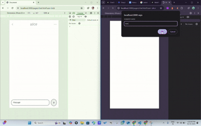

# Konvo

Konvo is a chat application.


## Demo



## Screenshots


## Table of Contents
- Project Overview
- Installation
- Usage
- Contribution
- License
- Screenshots
- Demo

## Project Overview
Konvo is a chat application designed to facilitate real-time messaging between users. It is built using a combination of JavaScript, SCSS, CSS, and HTML.

## Installation
To install and run the project locally, follow these steps:

1. Clone the repository:
   ```sh
   git clone https://github.com/sahil-verma-9696/Konvo.git
   ```

2. Navigate to the project directory:
   ```sh
   cd Konvo
   ```

3. Install the dependencies:
   ```sh
   npm install
   ```

4. Start the application:
   ```sh
   npm start
   ```

## Usage
After starting the application, you can access it in your web browser at `http://localhost:3000`. You can create an account, log in, and start chatting with other users.

## Contribution
Contributions are welcome! If you would like to contribute to this project, please follow these steps:

1. Fork the repository.
2. Create a new branch:
   ```sh
   git checkout -b feature-branch
   ```
3. Make your changes and commit them:
   ```sh
   git commit -m "Description of changes"
   ```
4. Push to the branch:
   ```sh
   git push origin feature-branch
   ```
5. Create a pull request.

## License
This project is licensed under the MIT License.

## Demo
[](https://konvo-8458.onrender.com)

[](https://konvo-8458.onrender.com)

Replace the placeholders with the actual paths to your assets.
